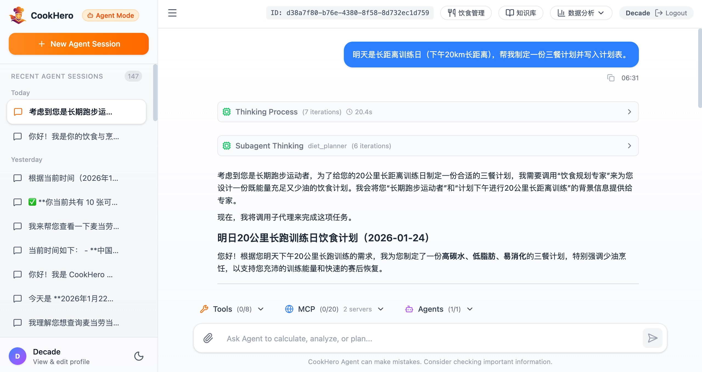
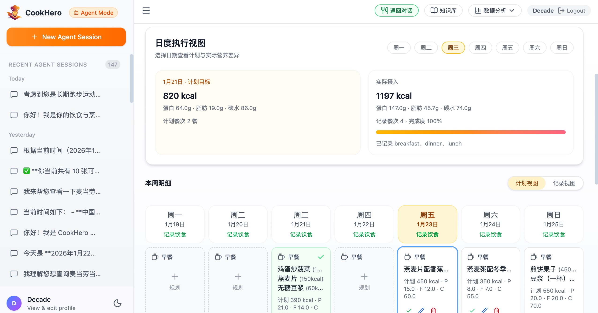
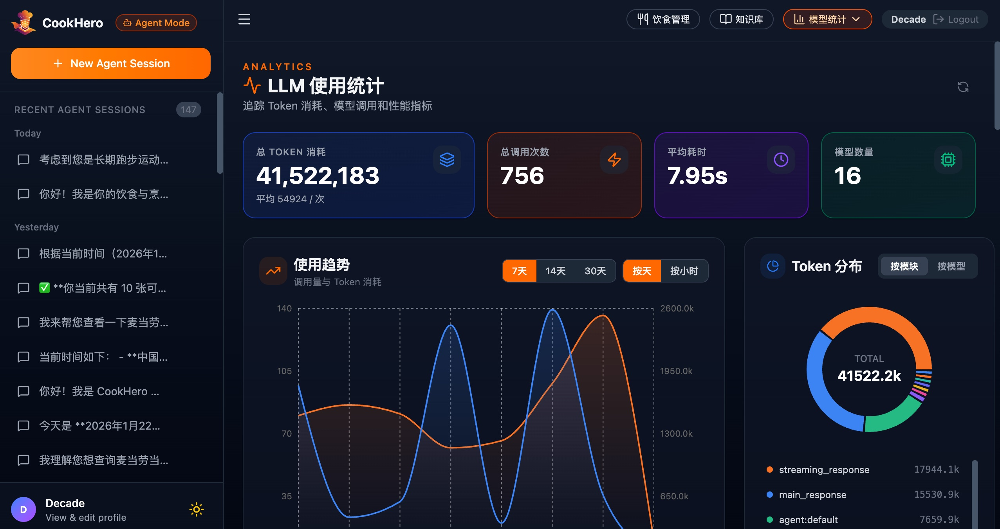

<div align="center">


**智能烹饪与饮食管理助手 · 你的个性化饮食英雄**

[](https://www.python.org/)
[](https://fastapi.tiangolo.com/)
[](https://www.langchain.com/)
[](https://milvus.io/)
[](https://github.com/NVIDIA/NeMo-Guardrails)
[](https://docs.ragas.io/)
[](LICENSE)

简体中文 | [English](./docs/README_EN.md)

---

</div>

<div align="center">
<p align="center">
  
  
  
  
</p>
</div>

---

## 📖 项目简介

**CookHero**（烹饪英雄）是一个融合 LLM、RAG、Agent、多模态与营养数据分析的个性化饮食管理平台。它不仅是菜谱库，更是一位能陪你做计划、做记录、看数据、给建议的“饮食管理英雄助手”，帮助你把烹饪与健康目标变成可执行的日常。

- 🔍 **智能问答**：解答烹饪技巧、食材搭配、营养知识等问题
- 🍽️ **个性化推荐**：根据口味、目标和限制提供更贴合的菜品选择
- 🗓️ **饮食计划**：按周规划三餐与加餐，形成可执行的饮食节奏
- 🧾 **AI 记录**：文字/图片一键记录，自动估算热量与宏量营养
- 📊 **营养分析**：每日/每周统计与计划偏差分析，持续优化习惯
- 🧠 **深度理解**：多轮对话理解用户意图，输出精准行动建议
- 🌐 **实时搜索**：结合 Web 搜索获取最新烹饪资讯和趋势

CookHero 面向厨房新手、健身/减脂/控糖人群、健康饮食倡导者、过敏体质用户及家庭场景，致力于让烹饪更专业、更智能、更可持续。

> 内部自带的食谱来源于[Anduin2017/HowToCook](https://github.com/Anduin2017/HowToCook)，感谢该项目的贡献者！

---

## ⚡ 技术亮点

- **LLM + RAG 混合检索**：向量 + BM25 + Reranker 组合，配合多级缓存提速
- **Agent ToolHub**：ReAct 推理 + 工具调用，支持 MCP 动态扩展
- **Subagent 专家体系**：内置 + 用户自定义子代理，按需启用与编排
- **多模态解析**：图片识别与饮食记录联动，覆盖烹饪与记录场景
- **评估与可观测性**：RAGAS 质量评估 + LLM 使用统计 + 可视化看板
- **安全与合规**：提示词注入防护、速率限制、结构化审计日志
- **现代化全栈**：FastAPI + React + PostgreSQL + Milvus + Redis + MinIO

## ✨ 核心功能

### 1. Agent 智能饮食管家
- **ReAct 模式**：实现推理 + 行动循环，支持自主决策和工具调用
- **多模态支持**：支持上传图片，图片自动上传到 imgbb 持久化存储
- **用户画像集成**：自动读取用户画像和长期指令，提供个性化饮食管理服务
- **Subagent 子代理**：内置/自定义专家可作为工具被调用，独立 system prompt 与工具集
- **Subagent 管理**：个人中心创建/启用/禁用，工具选择器支持 Agents 面板
- **内置工具**：
  - 饮食工具：计划管理、饮食记录、营养分析
  - 知识库检索：调用内置 RAG 检索并返回可引用来源
  - Web 搜索：集成 Tavily 搜索引擎，联网查询实时信息
  - AI 图片生成：基于 DALL-E 3 等模型生成图片，自动上传到 imgbb 持久化
  - 计算器：数学计算
  - 日期时间：获取当前时间、时区转换
- **MCP 协议支持**：支持用户自定义 MCP 服务器并配置鉴权头
- **可扩展架构**：通过 AgentHub 统一管理 Agent、Tool 和 Provider
- **上下文压缩**：自动压缩长对话历史，减少 Token 消耗
- **实时反馈**：SSE 事件流，实时展示工具调用过程和结果
- **执行追踪**：主 Agent 与 Subagent 轨迹分层展示，支持调试分析
- **工具选择**：前端可动态选择工具与子代理

### 2. 饮食计划与记录
- 周视图管理早餐/午餐/晚餐/加餐，形成可执行的饮食计划
- 计划餐次自动汇总热量与宏量营养
- 一键标记已吃，计划自动转化为真实记录
- AI 解析文字/图片饮食描述，自动估算营养信息
- 支持餐次更新、复制与备注管理

### 3. 营养分析与目标追踪
- 每日/每周营养总览（热量、蛋白、脂肪、碳水）
- 计划 vs 实际偏差分析，识别饮食习惯波动
- 目标管理：卡路里/蛋白/脂肪/碳水目标
- 数据来源标记：手动、AI 文本、AI 图片

### 4. 智能对话式菜谱查询
- 自然语言理解用户需求（如"我想做一道低脂高蛋白的晚餐"）
- 支持多轮对话，记录上下文历史
- 自动识别用户意图（查询、推荐、闲聊等）
- 流式响应，支持实时显示生成内容

### 5. 个性化知识库
- 用户可上传私人食谱，系统自动分析并索引
- 全局食谱库（来自 [HowToCook](https://github.com/Anduin2017/HowToCook)）与个人食谱融合查询
- 支持 Markdown 格式食谱的智能解析

### 6. 混合检索与重排序
- **向量检索**：语义相似度匹配（基于 Milvus）
- **BM25 检索**：关键词精确匹配
- **元数据过滤**：根据烹饪时间、难度、营养成分等筛选
- **智能重排序**：使用 Reranker 模型（如 Qwen3-Reranker）对结果二次精排
- **多级缓存**：Redis + Milvus 双层缓存，提升响应速度

### 7. 多模态支持
- **图片识别**：支持上传食材/菜品/饮食图片进行智能识别
- **意图理解**：结合图片和文字理解用户完整意图
- **多种场景**：菜品识别、食材识别、烹饪指导、饮食记录、食谱查询
- **灵活接入**：支持 OpenAI 兼容的视觉模型 API
- **图片限制**：最多 4 张、单张 10MB（Agent/饮食记录场景）

### 8. RAG 评估系统
- **质量监控**：基于 RAGAS 框架的自动化评估
- **核心指标**：忠实度（Faithfulness）、答案相关性（Answer Relevancy）
- **异步评估**：后台异步执行，不影响响应速度
- **趋势分析**：支持评估趋势查看和质量告警
- **数据持久化**：评估结果存储于 PostgreSQL

### 9. LLM 使用统计
- **实时监控**：跟踪每个请求的 Token 使用量
- **性能指标**：记录响应时间、思考时间、生成时间
- **统计分析**：按用户、会话、模块统计使用情况
- **工具追踪**：记录 Agent 工具调用名称
- **可视化展示**：前端提供 LLM 统计数据页面

### 10. 安全防护体系
- **多层防护**：输入验证 → 模式检测 → LLM 深度检测
- **提示词注入防护**：基于规则和 AI 的双重检测机制
- **速率限制**：Redis 滑动窗口算法，按端点类型区分限制
- **账户安全**：登录失败锁定、JWT 过期策略、安全响应头
- **敏感数据保护**：日志脱敏、API Key 过滤
- **安全审计**：结构化 JSON 审计日志，支持 SIEM 系统对接

> 📖 详细安全架构请参阅 [安全策略文档](docs/SECURITY.md)
>
> 📘 论文/答辩用的技术选型与实现原理请参阅 [技术选型与实现原理（毕业论文/答辩版）](docs/THESIS_TECHNICAL_OVERVIEW.md)

---

## 🚀 快速开始

### 前置要求

- **Python**：>= 3.12
- **Node.js**：>= 18
- **Docker** 和 **Docker Compose**（推荐）

### 方法一：Docker 一键部署（推荐）

1. **克隆项目**
   ```bash
   git clone https://github.com/Decade-qiu/CookHero.git
   cd CookHero
   ```

2. **配置环境变量**
   ```bash
   cp .env.example .env
   # 编辑 .env 文件，填入必要的 API Key
   ```

3. **启动基础设施**
   ```bash
   cd deployments
   docker-compose up -d
   ```
   这将启动：
   - PostgreSQL (端口 5432)
   - Redis (端口 6379)
   - Milvus (端口 19530)
   - MinIO (端口 9001)
   - Etcd (内部使用)

4. **安装 Python 依赖并启动后端**
   ```bash
   cd ..
   python -m venv .venv
   source .venv/bin/activate  # Windows: .venv\Scripts\activate
   pip install -r requirements.txt
   
   # 初始化数据库
   python -m scripts.howtocook_loader
   
   # 启动后端服务
   uvicorn app.main:app --host 0.0.0.0 --port 8000 --reload
   ```

5. **启动前端**
   ```bash
   cd frontend
   npm install
   npm run dev
   ```

6. **访问应用**
   - 前端：http://localhost:5173
   - 饮食管理：http://localhost:5173/diet
   - 后端 API：http://localhost:8000
   - API 文档：http://localhost:8000/docs

---

## ⚙️ 配置说明

### 1. 环境变量 (`.env`)

创建 `.env` 文件（参考 `.env.example`）：

```env
# ==================== LLM API 配置 ====================
# 主 API Key（所有模块的默认 Key）
LLM_API_KEY=your_main_api_key

# 快速模型 API Key（用于意图识别、查询改写等）
FAST_LLM_API_KEY=your_fast_model_api_key

# 视觉模型 API Key（用于多模态分析）
VISION_API_KEY=your_vision_model_api_key

# Reranker API Key（用于结果重排序）
RERANKER_API_KEY=your_reranker_api_key

# ==================== 数据库配置 ====================
DATABASE_PASSWORD=your_postgres_password

# Redis 密码（可选）
REDIS_PASSWORD=your_redis_password

# Milvus 认证（可选）
MILVUS_USER=root
MILVUS_PASSWORD=your_milvus_password

# ==================== Web 搜索 ====================
WEB_SEARCH_API_KEY=your_tavily_api_key

# ==================== MCP 集成 ====================
# 高德地图 MCP 服务 API Key
AMAP_API_KEY=your_amap_api_key
# 内置饮食预算 MCP（默认自动注册）
MCP_DIET_AUTO_REGISTER_ENABLED=true
MCP_DIET_ENDPOINT=https://cookhero-collab-20260215.onrender.com/api/v1/mcp/diet-adjust
MCP_DIET_AUTH_HEADER_NAME=X-MCP-Service-Key
MCP_DIET_SERVICE_KEY=cookhero-mcp-demo-key-v1

# ==================== 图片生成 ====================
# OpenAI 兼容的图片生成 API Key（DALL-E 3 等）
IMAGE_GENERATION_API_KEY=your_openai_api_key
# imgbb 图床 API Key（用于图片持久化存储）
IMGBB_STORAGE_API_KEY=your_imgbb_api_key

# ==================== 安全认证 ====================
JWT_SECRET_KEY=your_secure_jwt_secret_key
JWT_ALGORITHM=HS256

# 访问令牌过期时间（分钟）
ACCESS_TOKEN_EXPIRE_MINUTES=60

# 刷新令牌过期时间（天）
REFRESH_TOKEN_EXPIRE_DAYS=7

# ==================== 速率限制 ====================
RATE_LIMIT_ENABLED=true
RATE_LIMIT_LOGIN_PER_MINUTE=5
RATE_LIMIT_CONVERSATION_PER_MINUTE=30
RATE_LIMIT_GLOBAL_PER_MINUTE=100

# ==================== 账户安全 ====================
LOGIN_MAX_FAILED_ATTEMPTS=5
LOGIN_LOCKOUT_MINUTES=15
MAX_MESSAGE_LENGTH=10000
MAX_IMAGE_SIZE_MB=5
PROMPT_GUARD_ENABLED=true
```

### 2. 主配置文件 (`config.yml`)

`config.yml` 包含应用的核心配置：

```yaml
# LLM 提供商配置（分层：fast / normal / vision）
llm:
  fast:    # 快速模型（低延迟）
  normal:  # 标准模型
  vision:  # 视觉模型（多模态）

# 数据路径
paths:
  base_data_path: "data/HowToCook"

# 嵌入模型
embedding:
  model_name: "BAAI/bge-small-zh-v1.5"

# 向量存储
vector_store:
  type: "milvus"
  collection_names:
    recipes: "cook_hero_recipes"
    personal: "cook_hero_personal_docs"

# 检索配置
retrieval:
  top_k: 9
  score_threshold: 0.2
  ranker_type: "weighted"
  ranker_weights: [0.8, 0.2]

# 重排序配置
reranker:
  enabled: true
  model_name: "Qwen/Qwen3-Reranker-8B"

# 缓存配置
cache:
  enabled: true
  ttl: 3600
  l2_enabled: true
  similarity_threshold: 0.92

# Web 搜索配置
web_search:
  enabled: true
  max_results: 6

# 视觉/多模态配置
vision:
  model:
    enabled: true
    model_name: "Qwen/QVQ-72B-Preview"

# 评估配置
evaluation:
  enabled: true
  async_mode: true
  sample_rate: 1.0

# MCP 配置
mcp:
  amap:
    enabled: true

# 图片生成配置
image_generation:
  enabled: true
  model: "dall-e-3"

# 图片存储配置（imgbb）
image_storage:
  enabled: true

# 数据库连接
database:
  postgres:
    host: "localhost"
    port: 5432
  redis:
    host: "localhost"
    port: 6379
  milvus:
    host: "localhost"
    port: 19530
```

详细配置说明见 `config.yml` 文件中的注释。

---

## 🗺️ 未来规划 (Roadmap)

- [x] **多模态支持**：食材图片识别、菜品识别 ✅
- [x] **RAG 评估系统**：基于 RAGAS 的质量监控 ✅
- [x] **安全防护体系**：输入验证、提示词注入防护、速率限制 ✅
- [x] **LLM 使用统计**：Token 监控、性能分析页面 ✅
- [x] **Agent 智能模式**：ReAct 推理、工具调用、会话管理 ✅
- [x] **Subagent 专家体系**：内置与自定义子代理、可视化追踪 ✅
- [x] **MCP 协议支持**：远程工具加载、高德地图集成 ✅
- [x] **AI 图片生成**：DALL-E 3 集成、imgbb 持久化存储 ✅
- [x] **饮食计划与记录**：周计划、已吃标记、AI 记录 ✅
- [x] **营养分析与目标追踪**：每日/每周摘要、偏差分析 ✅
- [ ] **语音交互**：语音输入查询、语音播报步骤
- [ ] **社区功能**：用户分享、评分、评论
- [ ] **智能食材管理**：冰箱清单、食材过期提醒
- [ ] **AR 烹饪指导**：增强现实辅助烹饪
- [ ] **更多 Agent 工具**：食谱搜索、营养计算、购物清单生成

---

## 🤝 贡献指南

欢迎贡献代码、提出问题或建议！

1. Fork 本项目
2. 创建特性分支 (`git checkout -b feature/AmazingFeature`)
3. 提交更改 (`git commit -m 'Add some AmazingFeature'`)
4. 推送到分支 (`git push origin feature/AmazingFeature`)
5. 提交 Pull Request

---

## 📄 开源协议

本项目基于 [APACHE LICENSE 2.0](LICENSE) 许可证开源。详情请参阅 LICENSE 文件。

---

## 🙏 致谢

- [HowToCook](https://github.com/Anduin2017/HowToCook) - 优质的开源食谱库
- [LangChain](https://www.langchain.com/) - 强大的 LLM 应用框架
- [Milvus](https://milvus.io/) - 高性能向量数据库
- [FastAPI](https://fastapi.tiangolo.com/) - 现代化的 Python Web 框架
- [NVIDIA NeMo Guardrails](https://developer.nvidia.com/nvidia-nemo) - 先进的安全防护框架
- [RAGAS](https://docs.ragas.io/) - RAG 评估框架

---

<div align="center">

**如果这个项目对您有帮助，请给一个 ⭐️ Star 支持一下！**

</div>
