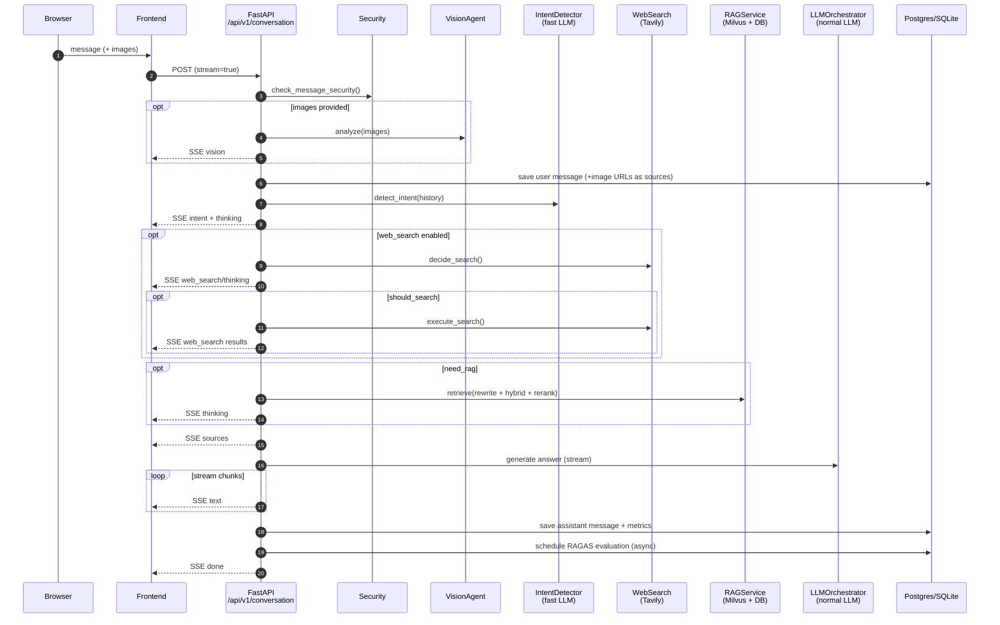
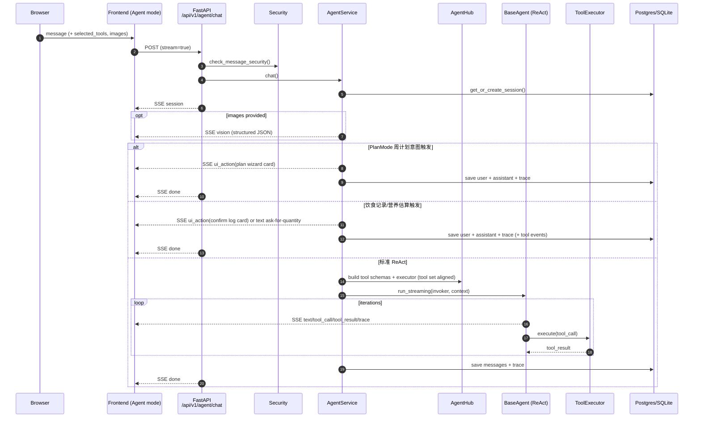
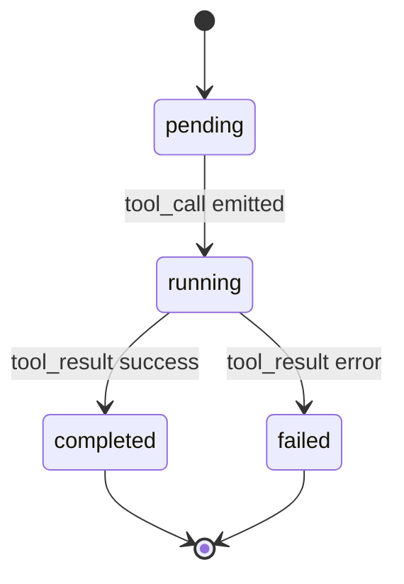
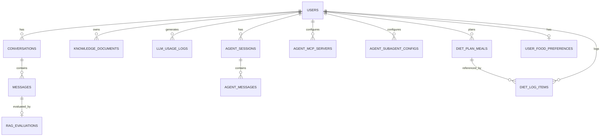

# CookHero 技术选型与实现原理（毕业论文/答辩版）

> 文档定位：把“实现了什么”转成“为什么这样选、怎么实现、关键点在哪里、如何验证”的论文式叙述。  
> 写作风格：中文为主，关键术语保留英文（RAG / ReAct / SSE / MCP / reranker 等）。  

---

## 0. 文档信息

- **项目名称**：CookHero（智能烹饪与饮食管理助手）
- **文档版本**：v1
- **编写日期**：2026-03-13
- **适用读者**：毕业论文撰写、答辩演示、技术评审
- **代码基线**：以当前仓库 `main` 分支为准（本文件与代码同仓维护）

### 0.1 快速导航

- [1. 项目背景与目标](#1-项目背景与目标)
- [2. 总体架构](#2-总体架构)
- [3. 技术选型与理由（表格）](#3-技术选型与理由表格)
- [4. 核心流程与实现原理](#4-核心流程与实现原理)
- [5. 关键技术要点（难点与解决方案）](#5-关键技术要点难点与解决方案)
- [6. 数据库与数据设计](#6-数据库与数据设计)
- [7. 部署与工程化](#7-部署与工程化)
- [8. 答辩口径与常见问答（附录）](#8-答辩口径与常见问答附录)
- [9. 局限与未来工作](#9-局限与未来工作)

---

## 1. 项目背景与目标

### 1.1 问题定义

现实饮食管理存在三个典型问题：

1. **知识分散**：菜谱、烹饪技巧、营养学、控糖/减脂建议散落在不同来源，难以形成“可执行的日常方案”。
2. **执行困难**：用户往往能看懂建议，但难以把建议转化为计划（meal plan）与记录（meal log），缺少可追踪的反馈闭环。
3. **个性化不足**：偏好、过敏、目标、情绪状态会影响“今天怎么吃”，单一静态菜谱库难以满足个体差异。

CookHero 的定位是：融合 **LLM + RAG + Agent + 多模态 + 营养分析**，让用户从“提问”到“计划与记录落地”形成闭环，并且过程可解释、可验证、可演示。

### 1.2 目标用户与核心场景

- 厨房新手：需要步骤清晰的菜谱与技巧解释
- 健身/减脂/控糖用户：需要可执行的周计划与偏差分析
- 过敏/忌口用户：需要可控的食材过滤与替代建议
- 家庭场景：需要更稳定的推荐与计划工具化落地

核心场景（论文可作为“需求分析”落点）：

- **智能问答**：做法、技巧、食材搭配、营养知识
- **饮食计划**：周计划生成、下一餐纠偏建议
- **AI 记录（文本/图片）**：识别食物并估算营养，最终由用户确认写入
- **营养分析**：日/周统计、计划 vs 实际偏差
- **多 Agent 协作**：识别（recognition）/规划（planning）/共情（emotion support）阶段可视化

### 1.3 约束与非功能性指标

- **低延迟**：多数交互需要秒级响应；长任务需流式输出（Streaming）
- **确定性写入**：涉及“写库”的动作必须有确定触发点（避免 LLM 口头承诺但未落库）
- **可解释性**：提供 sources（引用来源）、trace（工具调用轨迹）、指标（token/耗时/质量）
- **安全**：提示词注入防护、速率限制、敏感信息脱敏与审计
- **可部署性**：支持本地快速启动与云端部署（Vercel + Render），配套烟测（smoke test）

---

## 2. 总体架构

### 2.1 全栈架构图（逻辑视图）

```mermaid
flowchart LR
  U[User Browser] -->|HTTPS| FE[Frontend<br/>React + TypeScript + Vite<br/>(Vercel)]
  FE -->|SSE / JSON<br/>/api/v1/*| BE[Backend<br/>FastAPI (Render / Local)]

  BE --> DB[(PostgreSQL / SQLite)]
  BE --> REDIS[(Redis)]
  BE --> MILVUS[(Milvus)]
  MILVUS --> ETCD[(etcd)]
  MILVUS --> MINIO[(MinIO)]

  BE -->|OpenAI-compatible API| LLM[LLM Providers<br/>fast / normal / vision]
  BE -->|Rerank API| RR[Reranker Provider<br/>(SiliconFlow)]
  BE -->|Web Search| TAV[Tavily]
  BE -->|Image persistence| IMGBB[imgbb]
  BE -->|Tool extensibility| MCP[MCP Servers<br/>(builtin + user-defined)]
```

### 2.2 本地链路 vs 生产链路

项目同时支持“快速本地开发/演示模式”和“生产云端模式”，通过环境变量覆盖实现切换：

- **本地（Local Dev / Demo）**
  - 前端：Vite 开发服务器，`frontend/vite.config.ts` 对 `/api/*` 代理到 `http://localhost:8000`
  - 后端：`uvicorn app.main:app --reload`
  - 数据库：默认可走 SQLite（配置文件 `config.yml` 中 `database.postgres.host: sqlite` + `cookhero.db`）
  - Milvus：支持两种模式
    - Milvus Standalone（Docker Compose）
    - Milvus Lite（当 `database.milvus.host` 为路径形式 `./xxx.db` 时，走 `uri` 模式，dense-only）

- **生产（Vercel + Render）**
  - 前端：Vercel 部署 `frontend/`，并通过 `frontend/vercel.json` 把 `/api/v1/*` 同域代理到 Render 后端
  - 后端：Render Python 服务
  - 数据库：Render Postgres（推荐用 `DATABASE_URL` 注入，配置优先级见 `app/config/config_loader.py`）
  - 基础设施：可用 `deployments/docker-compose.yml` 在自有机器/服务器上部署 Redis/Milvus/MinIO/Postgres

论文写法建议：把“链路一致性”的设计动机写清楚，即“前端永远请求相对路径 `/api/v1`，避免跨域与配置分叉”，从而降低部署复杂度与排障成本。

---

## 3. 技术选型与理由（表格）

> 表中版本/范围来源：`.python-version`、`requirements.txt`、`frontend/package.json`、`deployments/docker-compose.yml`、`config.yml`。  

| 组件 | 选型 | 版本/范围（仓库基线） | 选择理由 | 备选方案与取舍 |
|---|---|---|---|---|
| 后端语言 | Python | `3.12.7`（见 `.python-version`） | 生态成熟，AI/RAG 工具链齐全，FastAPI 异步性能好 | Java/Go：工程性强但 AI 生态集成成本更高 |
| Web 框架 | FastAPI | `fastapi>=0.115.0` | 异步 + 类型提示友好；OpenAPI 文档自动生成；适合 SSE | Flask：同步为主；Django：更重但可用于大型后台 |
| 数据校验 | Pydantic | `pydantic>=2.9.0` | 请求/响应模型可读性强；参数约束清晰 | Marshmallow：灵活但类型体验较弱 |
| ORM / 数据访问 | SQLAlchemy Async | `sqlalchemy>=2.0.30` | 异步会话、事务一致性；模型层适合论文表达“数据设计” | Tortoise ORM：更轻但成熟度/生态略弱 |
| 关系型数据库 | PostgreSQL / SQLite | Postgres：生产推荐（`DATABASE_URL`）；SQLite：本地快速模式（`sqlite+aiosqlite`） | PG 支撑并发与索引；SQLite 便于演示与快速启动 | MySQL：可用但 JSON/扩展生态取舍；纯 SQLite 不适合多用户并发 |
| 缓存/限流底座 | Redis | `redis>=5.0.0`；Docker `redis:alpine` | L1 缓存、滑动窗口限流、登录失败锁定等都适合用 Redis | 本地内存：简单但不可分布式；Rate-limit 中间件：灵活度较低 |
| 向量数据库 | Milvus | `pymilvus>=2.3.0`；Docker `milvusdb/milvus:v2.5.14` | 支持向量检索、可扩展；并可用 hybrid search（dense + BM25） | FAISS：本地快但服务化/过滤能力弱；Elastic：强检索但向量成本与集成复杂 |
| 对象存储（Milvus 依赖） | MinIO + etcd | `minio/minio:RELEASE.2023-03-20...` + `quay.io/coreos/etcd:v3.5.16` | Milvus standalone 依赖；本地可用 docker-compose 一键起 | 使用云对象存储/etcd：更稳但配置更重 |
| 前端框架 | React + TS | `react^19.2.0`、`typescript~5.9.3` | 组件化与类型系统提升维护性；适合流式 UI | Vue：同样可行；React 在生态与组合能力上更强 |
| 构建工具 | Vite | `vite^7.2.4` | 冷启动快；开发体验好；代理配置简单 | Webpack：成熟但配置重 |
| UI/样式 | TailwindCSS | `tailwindcss^4.1.18` | 原子化样式便于快速迭代；减少自定义 CSS 维护成本 | CSS Modules：更传统；UI 框架：能加速但容易风格同质化 |
| 路由 | React Router | `react-router-dom^7.10.1` | SPA 路由成熟，适合多模块页面（聊天/饮食/统计/社区） | Next.js App Router：更强但需要 SSR/路由框架改造 |
| 图表 | Recharts | `recharts^3.6.0` | 营养统计、趋势图展示简单直观 | ECharts：更强但体积/配置复杂 |
| LLM 编排 | LangChain（OpenAI-compatible） | `langchain>=0.3.0`、`langchain-openai==0.3.35` | 对话消息结构、工具调用、流式输出封装成熟；可切换多家兼容 API | 直接调用 OpenAI SDK：更轻但需要自建工具调用与 tracing |
| LLM SDK | OpenAI Python | `openai>=2.20.0,<3.0.0` | 用于图片生成等 OpenAI-compatible 接口 | 直连厂商 SDK：绑定更深，不利于可迁移性 |
| Embedding | BGE 中文向量 | `BAAI/bge-small-zh-v1.5`（见 `config.yml`） | 对中文语义检索效果较好；成本可控 | OpenAI embeddings：质量好但成本与依赖更强 |
| Reranker | Qwen3-Reranker | `Qwen/Qwen3-Reranker-8B`（见 `config.yml`） | 在“粗召回”后提升精排相关性；提升回答引用质量 | 交叉编码器本地部署：成本高；不 rerank：易出现 sources 不相关 |
| Web 搜索 | Tavily | `tavily-python` | 专门为检索增强场景设计；接口简单 | SerpAPI：可用但成本与限制不同 |
| 评估 | RAGAS | README 提及 + `app/services/evaluation_service.py` | 评估忠实度/相关性，形成质量监控闭环 | 离线标注评估：更准但成本高；不评估：无法量化质量 |
| 安全护栏 | Prompt Guard +（可选）NeMo Guardrails | 规则检测在 `app/security/*`；README 提及 NeMo | Defense in Depth：低成本规则拦截 + 高成本深度检测 | 仅规则：对变体攻击弱；仅 LLM：成本与不确定性更高 |
| 部署 | Docker Compose + Vercel + Render | `deployments/docker-compose.yml`、`frontend/vercel.json` | 一键拉起基础设施；前后端平台化部署降低运维门槛 | Kubernetes：更强但超出毕业项目必要复杂度 |
| 监控/验收 | GitHub Actions + Smoke Scripts | `scripts/smoke-prod.sh` 等 | 可持续交付：发布后可回归、可排障 | 手工验证：不可持续、不可重复 |

---

## 4. 核心流程与实现原理

本项目的核心不是“把 LLM 接进来”，而是把 LLM 放进一条工程可控的链路中：**输入校验 → 多模型编排 → 工具调用/检索增强 → 可观测 → 可验证落库**。

### 4.1 普通对话（Conversation）链路

**入口**：`POST /api/v1/conversation`（SSE）

- **输入**：message、conversation_id、extra_options、images(base64)
- **输出**：SSE 事件流（`vision/intent/thinking/text/sources/done`）
- **落库**：user/assistant message、sources、耗时统计、（可选）RAGAS 评估记录

#### 4.1.1 链路时序图



#### 4.1.2 关键实现点（论文可写“实现细节”）

1. **断连不丢消息**：`app/api/v1/endpoints/conversation.py` 使用 `asyncio.Queue` + 后台任务处理，把生成过程与客户端连接解耦。即使前端刷新/断线，后台仍继续跑完并保存消息。
2. **“先 sources，后生成”**：回答生成前先统一发出 sources（可能为空），让前端可展示“引用来源”，并支持后续评估与排障。
3. **多阶段“thinking”事件**：将 rewrite/intent/web_search/rag 准备等阶段以事件可视化，降低“黑盒感”，增强答辩展示效果。

**代码位置参考**：

- Conversation API：`app/api/v1/endpoints/conversation.py`
- 编排服务：`app/services/conversation_service.py`
- 安全检查：`app/security/*`、`app/security/dependencies.py`

---

### 4.2 Agent 链路（ReAct + 工具调用）

**入口**：`POST /api/v1/agent/chat`（SSE）

Agent 模式是“工具增强对话”的工程化实现：模型不仅生成文本，还能通过 function calling 调用工具（Tool），形成 **ReAct**（Reasoning-Action-Observation）循环，并把工具调用过程结构化呈现给前端。

#### 4.2.1 链路时序图（含两类短路策略）



#### 4.2.2 两类“卡片优先（Card-first）”短路策略

毕业答辩通常强调“可验证、可落地”。在 Agent 模式中，涉及“写库”的动作，如果完全由模型自然语言决定，会出现不确定性。因此项目引入了 **卡片优先**策略，把关键路径从“模型口头承诺”转成“用户确认点击”：

1. **PlanMode 周计划向导卡**
   - 触发条件：用户意图命中周计划模式（`AgentService._is_meal_plan_query`）
   - 行为：直接返回 `ui_action` 卡片，引导用户逐步补齐信息并生成计划
   - 目的：降低生成冗长问卷的概率，提高演示稳定性与交互确定性

2. **饮食记录确认卡（Meal Log Confirm）**
   - 触发条件：用户表达“帮我记录/我吃了…”或 vision 识别出食物项
   - 行为：先估算营养并生成“确认写入”卡片；只有用户点击才写库
   - 目的：避免“模型说已经记录”但后端未真正写库的风险，保证数据一致性

**代码位置参考**：

- ReAct 循环实现：`app/agent/agents/base.py`
- Agent 服务编排 + card-first：`app/agent/service.py`
- 工具抽象：`app/agent/tools/base.py`
- 工具聚合与动态提供者：`app/agent/registry/hub.py`

---

### 4.3 RAG 检索链路（Rewrite → Hybrid → Rerank → Small-to-Large）

RAG 的目标不是“把文档塞进提示词”，而是构建可控的检索增强回答：通过 rewrite 提升召回、通过 hybrid 提升覆盖、通过 rerank 提升相关性、通过 small-to-large 保证上下文完整性。

#### 4.3.1 处理流程图

```mermaid
flowchart TD
  Q[User Query] --> RW[Query Rewrite<br/>(fast LLM)]
  RW --> MF[Metadata Filter Extractor<br/>(fast LLM)]
  MF --> HS[Hybrid Search in Milvus<br/>dense + BM25<br/>ranker=weighted/rrf]
  HS --> RR[Rerank<br/>Qwen3-Reranker via API]
  RR --> PP[Small-to-Large Post-Process<br/>Fetch parent docs from DB]
  PP --> CTX[Build Context + Sources]
  CTX --> GEN[Answer Generation<br/>(normal LLM)]
  GEN --> OUT[Answer + Sources + Metrics]
```

#### 4.3.2 关键机制说明

1. **Query Rewrite（重写）**  
   使用 fast tier LLM 把关键词式输入变成自然问句，提升语义检索质量。  
   代码参考：`app/rag/pipeline/generation.py`

2. **Hybrid Search（混合检索）**  
   - 在 Milvus Standalone 场景启用 dense + sparse（BM25）混合检索，并支持 weighted/rrf 排序。  
   - 在 Milvus Lite（uri `.db`）场景仅启用 dense-only（作为轻量演示模式）。  
   代码参考：`app/rag/vector_stores/vector_store_factory.py`、`app/rag/pipeline/retrieval.py`

3. **Rerank（重排序）**  
   粗召回后通过 reranker API 做二次精排，进一步提高相关性，减少“引用来源不匹配”的情况。  
   代码参考：`app/rag/rerankers/siliconflow_reranker.py`

4. **Small-to-Large（小块到大文档）**  
   向量检索基于分块 chunk，但回答引用需要完整父文档。项目先召回 chunk，再按 `parent_id` 回表拿父文档内容，保留最优分数。  
   代码参考：`app/rag/pipeline/document_processor.py`

5. **缓存（可选）**  
   设计了 L1 Redis 精确缓存 + L2 Milvus 语义缓存，但在 `config.yml` 默认关闭（演示环境更可控）。  
   代码参考：`app/rag/cache/*`、`app/services/rag_service.py`

---

### 4.4 多 Agent 协作可视化（timeline + forced tool call）

为了提升“可解释性”和“答辩展示效果”，项目实现了协作时间线（collab_timeline）：

- 将一次用户输入拆成多个阶段（例如：识别/规划/共情）
- 将阶段状态（pending/running/completed/failed）实时推送给前端
- 当需要保证演示稳定时，可用 **forced tool call** 把某些工具调用变成可控的编排

#### 4.4.1 阶段状态机（概念）



#### 4.4.2 前端渲染机制

前端统一解析 SSE 事件类型 `collab_timeline` 与 `ui_action`：

- `collab_timeline`：用于渲染协作阶段卡（例如“识别完成/规划进行中/共情完成”）
- `ui_action`：用于渲染可点击落地卡片（例如“写入下一餐计划”“记录本餐”“查看周进度”）

代码位置参考：

- 后端：`app/agent/service.py`（构建/更新 timeline、拼装 ui_action）
- 前端：`frontend/src/components/agent/*Card*.tsx`（卡片组件）、`frontend/src/types/api.ts`（SSEEvent 类型）

---

## 5. 关键技术要点（难点与解决方案）

### 5.1 流式输出与断连不丢消息

**难点**：SSE 流式输出一旦前端刷新，连接断开；如果后端生成也停止，可能导致“消息未保存、状态不一致”。  
**方案**：conversation 模式采用“后台任务 + 队列”解耦，连接断开后后台继续跑完并落库。  
**代码参考**：`app/api/v1/endpoints/conversation.py`

### 5.2 LLM Provider 抽象（fast/normal/vision 分层 + 兼容多厂商）

**难点**：不同任务对延迟/质量要求不同；同时需要兼容不同厂商的 OpenAI-compatible API。  
**方案**：

- 配置层把 LLM 分成 `fast/normal/vision` profile（见 `config.yml` 的 `llm.*`）
- 调用层统一走 `LLMProvider + LLMInvoker`，并用 `contextvars` 传递 module/user/conversation 上下文
- 模型选择支持“每次调用随机 pick_model”，实现简单负载均衡

**代码参考**：`app/llm/provider.py`、`app/llm/context.py`

### 5.3 LLM 使用统计（Token/耗时/模块/工具维度）

**难点**：流式输出与多模块调用下，统计容易丢失；并且不能保存输入输出内容（隐私）。  
**方案**：

- LangChain callbacks 捕获 token usage 与耗时，并写入 `llm_usage_logs`
- 使用独立后台事件循环与独立 DB engine（避免主事件循环被阻塞）
- 仅记录统计信息，不落明文内容

**代码参考**：`app/llm/callbacks.py`、`app/database/models.py`

### 5.4 检索质量：rewrite + hybrid + rerank + 引用来源

**难点**：仅向量召回容易“语义相近但不包含关键步骤”；仅 BM25 又容易遗漏同义表达。  
**方案**：

- 用 rewrite 把用户输入转成自然语言问句
- 用 hybrid 检索提升召回覆盖（dense + sparse）
- 用 reranker 做精排减少不相关 sources
- 输出 sources，作为“可解释性”与“可验证性”的证据

**代码参考**：`app/services/rag_service.py`、`app/rag/*`

### 5.5 安全：Defense in Depth（多层防护）

从网络层、鉴权层、输入验证层、提示词注入层到输出过滤层，逐层降低风险。  
详细机制见 `docs/SECURITY.md`，常用点包括：

- Redis 滑动窗口限流
- JWT 鉴权 + 登录失败锁定
- 输入长度/图片大小限制
- Prompt Guard 规则检测 +（可选）NeMo Guardrails 深度检测
- 安全日志脱敏与审计日志

### 5.6 MCP 与可扩展工具（ToolHub）

**难点**：工具不仅是本地函数，还可能来自远端服务；需要统一管理、统一 schema、统一执行入口。  
**方案**：

- `AgentHub` 统一管理 Agent/Tool/Provider（local、mcp、subagent）
- MCP tool 通过 HTTP 调用远端服务，可配置鉴权 header
- 关键路径采用“优先 MCP、失败回落本地工具”的路由策略（例如 EmotionBudgetService）

**代码参考**：`app/agent/registry/hub.py`、`app/agent/tools/providers/*`、`app/services/emotion_budget_service.py`

---

## 6. 数据库与数据设计

### 6.1 ER 模型（概念图）

> 说明：为答辩与论文表达清晰，下图为概念 ER；实际代码中部分 `user_id` 字段是 `String` 而非外键约束（便于演示与快速迭代）。  



### 6.2 关键表与关键字段（论文写法建议）

1. **Conversation / Messages（普通对话）**
   - `messages.sources`：统一来源结构（含图像 URL、RAG 文档来源等）
   - `messages.thinking`：用于展示推理过程（可选）
   - `conversations.compressed_summary`：上下文压缩后的摘要，降低 token 成本

2. **Agent Sessions / Agent Messages（工具增强对话）**
   - `agent_messages.trace`：保存 tool_call/tool_result/timeline/ui_action 等可解释轨迹
   - `agent_messages.tool_calls/tool_call_id/tool_name`：工具调用结构化落库

3. **Knowledge Documents（知识库）**
   - 公共数据（HowToCook）与个人文档统一进入 `knowledge_documents`
   - chunk 检索后通过 `parent_id` 回表取父文档（small-to-large）

4. **RAG Evaluations（质量评估）**
   - 保存 `query/context/response` 与指标（faithfulness、answer_relevancy）
   - 支持 `alerts`（阈值告警）与 `trends`（趋势）

5. **LLM Usage Logs（可观测）**
   - 记录模块、模型、tokens、耗时；不保存明文输入输出
   - 支撑“成本估算”“性能瓶颈定位”“模型对比”

代码参考：

- 主要 ORM：`app/database/models.py`
- Agent ORM：`app/agent/database/models.py`
- Diet ORM：`app/diet/database/models.py`

---

## 7. 部署与工程化

### 7.1 本地启动（开发/演示）

基础设施（可选，但建议用于完整功能）：

- `deployments/docker-compose.yml` 启动：Postgres、Redis、Milvus、MinIO、etcd

后端：

- `pip install -r requirements.txt`
- `uvicorn app.main:app --host 0.0.0.0 --port 8000 --reload`

前端：

- `cd frontend && npm install && npm run dev`
- Vite 代理：`frontend/vite.config.ts` 把 `/api/*` 转发到 `localhost:8000`

### 7.2 生产部署（Vercel + Render）

生产链路关键点：

- 前端永远走相对路径：`VITE_API_BASE=/api/v1`
- Vercel 通过 `frontend/vercel.json` 把 `/api/v1/*` 代理到 Render 后端（同域代理，减少 CORS 问题）
- Render 后端通过环境变量配置：
  - `DATABASE_URL`（推荐）
  - `JWT_SECRET_KEY`、`CORS_ALLOW_ORIGINS`、各类 API KEY

可参考：

- `DEPLOYMENT_GUIDE.md`
- `QUICK_START.md`
- `docs/OPS_RUNBOOK.md`

### 7.3 CI/验收：烟测脚本与故障分级

项目提供 smoke scripts（用于发布验收与定时监控）：

- `scripts/smoke-prod.sh`
- `scripts/test-connection.sh`
- `scripts/smoke-community-e2e.sh`

论文写法建议：强调“可持续交付”的闭环（发布后自动烟测、失败可定位），体现工程化能力。

---

## 8. 答辩口径与常见问答（附录）

### 8.1 1 分钟项目介绍模板（可直接背诵）

> CookHero 是一个面向日常烹饪与健康饮食管理的智能助手平台。它把 LLM 的自然语言能力和 RAG 的知识检索能力结合起来，同时引入 Agent 工具调用，把“问答”扩展成“可执行的计划与记录”。  
> 在工程上，我把系统拆成前端 React、后端 FastAPI、关系库 Postgres、缓存 Redis、向量库 Milvus，并通过 SSE 流式输出把过程可视化。  
> 关键创新点有三点：第一是混合检索与 rerank 提升引用质量；第二是 ReAct Agent + MCP 工具让能力可扩展；第三是把写库动作做成卡片确认，保证数据一致性与演示稳定。系统还提供了 RAGAS 评估与 token/耗时统计，让质量与成本可量化。

### 8.2 10 分钟答辩展示顺序（建议）

> 可参考并精简现有脚本：`docs/DEMO_SCRIPT_COLLAB.md`

1. 登录并进入 Agent 模式，展示工具选择器（Tools/Agents）。
2. 输入“负面情绪 + 吃多内疚”句子：
   - 展示协作时间线卡（识别/规划/共情）状态变化
   - 展示智能推荐卡（下一餐纠偏、放松建议、周进度入口）
3. 点击“一键写入计划餐次”，到饮食管理页验证数据写入成功（强调“确定性写入”）。
4. 回到对话，输入“看本周进度”，展示周统计与偏差分析（强调“数据闭环”）。
5. 最后展示评估监控与模型统计页（强调“可观测/可评估/可持续”）。

### 8.3 高频问题 Q&A（答辩常见）

**Q1：为什么要用 RAG？直接让大模型回答不行吗？**  
A：直接回答容易幻觉且不可验证；RAG 通过检索把回答绑定到真实文档，并输出 sources，能提升忠实度与可解释性，同时也便于评估与排错。

**Q2：为什么要 hybrid（向量 + BM25）？**  
A：向量检索擅长语义相似，但可能漏掉“关键术语/步骤”；BM25 擅长关键词精确匹配但对同义表达弱。Hybrid 兼顾覆盖与精度。

**Q3：为什么还要 reranker？**  
A：召回阶段追求“尽量不漏”，会带入噪声；reranker 用更强的相关性模型做精排，显著提升最终上下文质量，减少“引用不相关”的情况。

**Q4：为什么用 SSE？WebSocket 不好吗？**  
A：SSE 适合“单向流式输出”场景，部署简单、浏览器兼容好；并且与 HTTP/反向代理配合更轻量。项目核心需求是“边生成边展示”，SSE 足够。

**Q5：如何防 prompt injection？**  
A：采用多层防护：输入规则检测（Prompt Guard）+（可选）NeMo Guardrails 深度检测 + 系统提示词结构化隔离 + 输出脱敏与审计日志。并且对高风险内容可直接拒答或降级处理。

**Q6：如何保证“写库”的确定性？**  
A：涉及写库的动作都设计为“卡片确认”或明确的 API 调用路径，模型只给建议，不直接宣称已写入。用户点击后触发后端确定性写入，再在页面中可验证。

**Q7：如何评估系统质量？**  
A：对 RAG 回答使用 RAGAS 计算 faithfulness、answer_relevancy 等指标，并提供趋势与告警；同时记录 token/耗时/模型分布，支撑成本与性能分析。

---

## 9. 局限与未来工作

1. **评估指标局限**：实时评估缺少 ground truth reference，因此 context_precision/context_recall 等指标难以稳定使用；后续可引入人工标注集做离线评估。
2. **数据质量与覆盖**：公共菜谱库来源单一时，知识覆盖有限；后续可扩展更多数据源并做去重与质量控制。
3. **冷启动与成本**：云端免费实例可能冷启动慢；可通过预热、缓存策略与更合理的采样率降低成本。
4. **向量库规模化**：更大规模下需要更精细的分片、索引策略与在线更新机制。
5. **长期个性化记忆**：当前用户画像与偏好已支持，但仍可引入更系统的长期记忆（Long-term Memory）与可解释的偏好学习。

